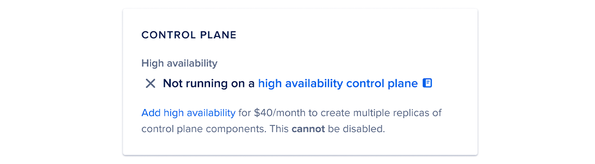

You can enable high availability using the DigitalOcean Kubernetes `doctl` update command or API endpoint by setting the `ha` value to `true`.


## How to Update a Kubernetes Cluster Using the DigitalOcean CLI

1. Install doctl, the official DigitalOcean CLI.
2. Create a personal access token and save it for use with doctl.
3. Use the token to grant doctl access to your DigitalOcean account.
doctl auth init
Finally, run doctl kubernetes cluster update. Basic usage looks like this, but you can read the usage docs for more details:
doctl kubernetes cluster update <id|name> [flags]
The following example updates a cluster named example-cluster to enable automatic upgrades and sets the maintenance window to saturday=02:00:
doctl kubernetes cluster update example-cluster --auto-upgrade --maintenance-window saturday=02:00

## How to Update a Kubernetes Cluster Using the DigitalOcean API

1. [Create a personal access token](https://docs.digitalocean.com/reference/api/create-personal-access-token/) and save it for use with the API.
2. Send a PUT request to [`https://api.digitalocean.com/v2/kubernetes/clusters/{cluster_id}`](https://docs.digitalocean.com/reference/api/digitalocean//#operation/kubernetes_update_cluster).

### cURL 
Using cURL:
```bash
curl -X PUT \
  -H "Content-Type: application/json" \
  -H "Authorization: Bearer $DIGITALOCEAN_TOKEN" \
  -d '{"name": "stage-cluster-01", "tags":["staging", "web-team"]}' \
  "https://api.digitalocean.com/v2/kubernetes/clusters/bd5f5959-5e1e-4205-a714-a914373942af"
```

### Go 

Using [Godo](https://github.com/digitalocean/godo), the official DigitalOcean API client for Go:

```bash
import (
    "context"
    "os"

    "github.com/digitalocean/godo"
)

func main() {
    token := os.Getenv("DIGITALOCEAN_TOKEN")

    client := godo.NewFromToken(token)
    ctx := context.TODO()

    updateRequest := &godo.KubernetesClusterUpdateRequest{
        Name: "stage-cluster-01",
        Tags: []string{"staging", "web-team"},
    }

    cluster, _, err := client.Kubernetes.Update(ctx, "bd5f5959-5e1e-4205-a714-a914373942af", updateRequest)
}
```

### Ruby 

Using [DropletKit](https://github.com/digitalocean/droplet_kit), the official DigitalOcean API client for Ruby:

```bash
require 'droplet_kit'
token = ENV['DIGITALOCEAN_TOKEN']
client = DropletKit::Client.new(access_token: token)

cluster = DropletKit::KubernetesCluster.new(
  name: 'foo',
  tags: ['staging', 'web-team']
)

client.kubernetes_clusters.update(cluster, id: 'bd5f5959-5e1e-4205-a714-a914373942af')
```

### Python 
Using [PyDo](https://github.com/digitalocean/pydo), the official DigitalOcean API client for Python:

```bash
import os
from pydo import Client

client = Client(token=os.environ.get("DIGITALOCEAN_TOKEN"))

req = {
  "name": "prod-cluster-01",
  "tags": [
    "k8s",
    "k8s:bd5f5959-5e1e-4205-a714-a914373942af",
    "production",
    "web-team"
  ],
  "maintenance_policy": {
    "start_time": "12:00",
    "day": "any"
  },
  "auto_upgrade": True,
  "surge_upgrade": True,
  "ha": True
}

resp = client.kubernetes.update_cluster(cluster_id="1fd32a", body=req)
```

# Enable High Availability Using the Control Panel 

To enable high availability on an existing cluster, go to the [control panel](https://cloud.digitalocean.com/kubernetes/clusters) and click the cluster you want to enable high availability on. Then, in the Overview tab, scroll down and find the following card.



## I can't find this card

DigitalOcean Kubernetes clusters originally created with version 1.20 or older have a version of the control plane which does not allow you to enable [high availability](https://docs.digitalocean.com/products/kubernetes/details/managed/#new-control-plane). If you cannot find this card, upgrade your control plane.

To check whether you can upgrade your cluster to the new control plane, see [Upgrading to New Control Plane](https://docs.digitalocean.com/products/kubernetes/how-to/upgrade-cluster/#new-control-plane).

In the card, click Add high availability. This opens a pop-up window where you can confirm your change. Once enabled, you cannot disable high availability in the future.


