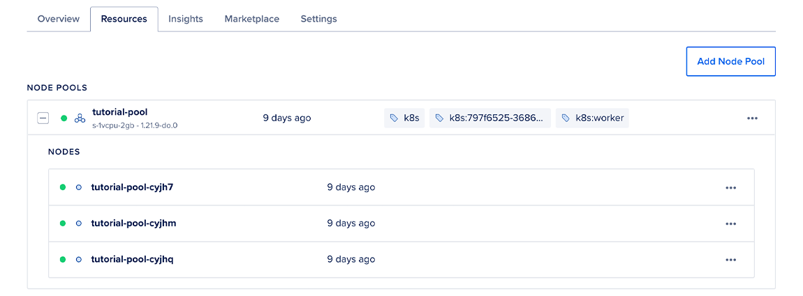
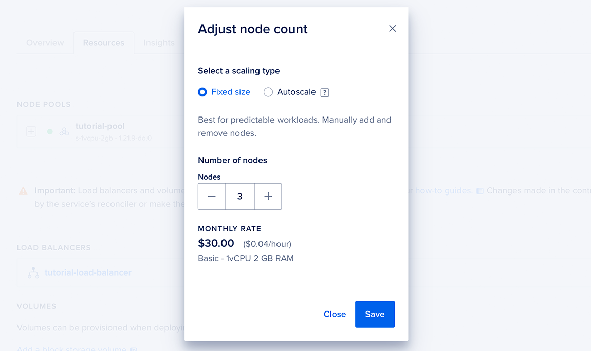

# Using the DigitalOcean Control Panel 

To disable autoscaling on an existing node pool, navigate to your cluster in [the Kubernetes section of the control panel](https://cloud.digitalocean.com/kubernetes/clusters), then click the Resources tab. Click the three dots to reveal the option to resize the node pool manually or enable autoscaling.




Select Resize or Autoscale, and a window opens prompting for configuration details. Select Fixed size and configure the number of nodes you want to assign to the pool.



# Using doctl 
To disable autoscaling, run an update command that specifies the node pool and cluster:

```bash
doctl kubernetes cluster node-pool update mycluster mypool --auto-scale=false
```