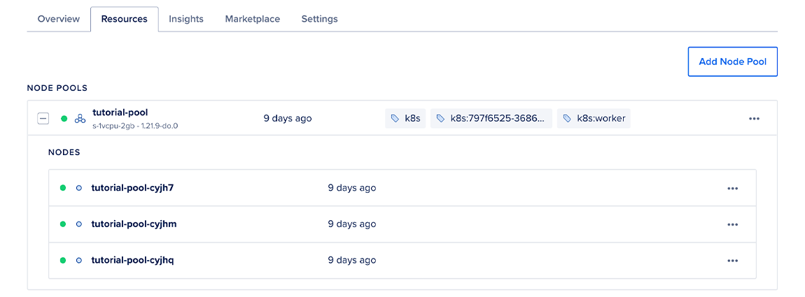
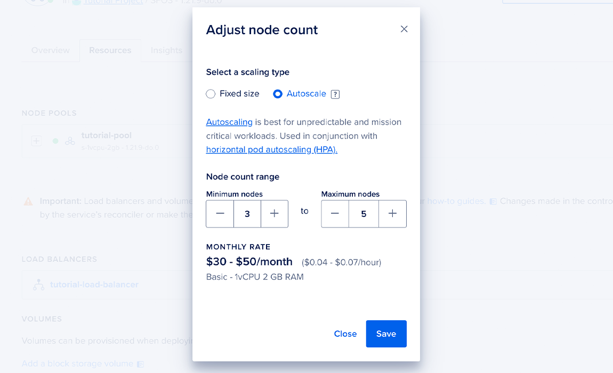

# Using the DigitalOcean Control Panel

To enable autoscaling on an existing node pool, navigate to your cluster in [the Kubernetes section of the control panel](https://cloud.digitalocean.com/kubernetes/clusters), then click the Resources tab. Click the three dots to reveal the option to resize the node pool manually or enable autoscaling.




Select Resize or Autoscale, and a window opens prompting for configuration details. After selecting Autoscale, you can set the following options for the node pool:

- Minimum Nodes: Determines the smallest size the cluster is allowed to “scale down” to; must be greater than or equal to 0 and no greater than Maximum Nodes. See [Scaling to Zero](https://docs.digitalocean.com/products/kubernetes/how-to/autoscale/#scaling-to-zero) for recommendations to follow for scaling down to zero.
- Maximum Nodes: Determines the largest size the cluster is allowed to “scale up” to. The upper limit is constrained by the Droplet limit on your account, which is 25 by default, and the number of Droplets already running, which subtracts from that limit. [You can request to have your Droplet limit increased.](https://cloud.digitalocean.com/account/profile/droplet_limit_increase)



# Using doctl 
You can use [`doctl`](https://docs.digitalocean.com/reference/doctl/) to enable cluster autoscaling on any node pool. You need to provide three specific configuration values:

- `auto-scale`: Specifies that autoscaling should be enabled
- `min-nodes`: Determines the smallest size the cluster is allowed to “scale down” to; must be greater than or equal to 0 and no greater than max-nodes. See [Scaling to Zero](https://docs.digitalocean.com/products/kubernetes/how-to/autoscale/#scaling-to-zero) for recommendations to follow for scaling down to zero.
- `max-nodes`: Determines the largest size the cluster is allowed to “scale up” to. The upper limit is constrained by the Droplet limit on your account, which is 25 by default, and the number of Droplets already running, which subtracts from that limit. [You can request to have your Droplet limit increased.](https://cloud.digitalocean.com/account/profile/droplet_limit_increase)

You can apply autoscaling to a node pool at cluster creation time if you use a semicolon-delimited string.

```bash
doctl kubernetes cluster create mycluster --node-pool "name=mypool;auto-scale=true;min-nodes=1;max-nodes=10"
```

You can also configure new node pools to have autoscaling enabled at creation time.
```bash
doctl kubernetes cluster node-pool create mycluster mypool --auto-scale --min-nodes 1 --max-nodes 10
```

If your cluster is already running, you can enable autoscaling on an any existing node pool.

```bash
doctl kubernetes cluster node-pool update mycluster mypool --auto-scale --min-nodes 1 --max-nodes 10
```

# Scaling to Zero 
The Cluster Autoscaler supports scaling a given node pool down to zero. This allows the autoscaler to run simulations and optimize an under-utilised node pool to completely scale it down if possible. You can enable autoscaling using the [control panel or the CLI](https://docs.digitalocean.com/products/kubernetes/how-to/autoscale/#enable-autoscaling). When planning to scale a node pool down to zero, DigitalOcean recommends following these guidelines:

- Maintain at least one fixed node pool of the smallest size with one node. This allows the DOKS [managed components](https://docs.digitalocean.com/products/kubernetes/details/managed/) to always be available and also provides headroom for the cluster autoscaler to scale down larger node sizes as needed. For node pools of larger size, enable autoscaling and set the minimum number of nodes to zero.

- If the unavailability of the managed components is not a consideration, then you can completely scale down all node pools of your cluster to zero nodes. To do this, set both the minimum and maximum nodes for each pool to zero.

This leaves all workloads in a pending state because there are no nodes present in the cluster. The workloads don’t run until you scale a node pool up again on demand.