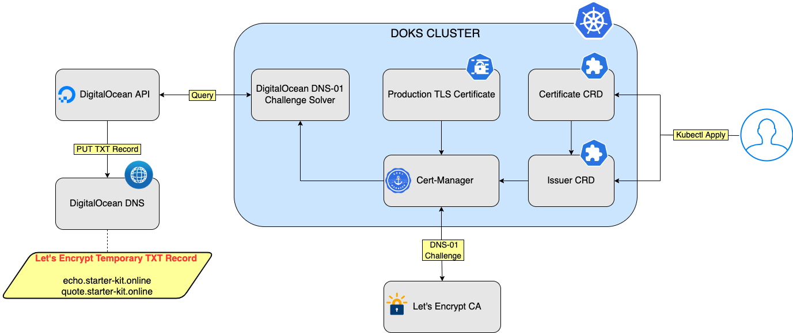

In the previous part of the tutorial series, you installed an NGINX Ingress Controller and configured the backend services. nginx comes with self-signed TLS certificates. For live environments, you may want to enable nginx to use production-ready TLS certificates for the backend services and automatically configure TLS certificates for your hosts. In this tutorial, the certificate issuer uses the [DNS-01 challenge](https://letsencrypt.org/docs/challenge-types/#dns-01-challenge) which supports wildcard certificates. A wildcard certificate is able to handle sub-domains as well and has global scope for the whole DNS domain you own. If you want to use HTTPS instead, you need to set up the [HTTP-01 challenge](https://letsencrypt.org/docs/challenge-types/#http-01-challenge), as described in [Set Up NGINX Ingress Controller with HTTPS Enabled](https://docs.digitalocean.com/products/kubernetes/getting-started/operational-readiness/enable-https/).

In this tutorial, you use Cert-Manager to set up the DNS-01 challenge. Cert Manager can handle DNS TXT records for DigitalOcean using the [DigitalOcean Provider](https://cert-manager.io/docs/configuration/acme/dns01/digitalocean/). To do so, you create a namespaced Issuer resource type, which is responsible for the [ACME challenge process](https://letsencrypt.org/docs/challenge-types/). The Issuer CRD also defines the required provider (DigitalOcean), to create DNS records during the DNS-01 challenge. You can find the manifests used in this tutorial in the [Kubernetes-Starter-Kit-Developers GitHub repository](https://github.com/digitalocean/Kubernetes-Starter-Kit-Developers/tree/main/03-setup-ingress-controller/assets/manifests/nginx).

The following diagram shows the setup used in this tutorial:



The user creates the [Issuer](https://docs.digitalocean.com/products/kubernetes/getting-started/operational-readiness/configure-wildcard-certificates/#step-3-configure-issuer-crd) and [certificate CRDs](https://docs.digitalocean.com/products/kubernetes/getting-started/operational-readiness/configure-wildcard-certificates/#step-4-configure-certificate-crd). Then, Cert-Manager initiates the DNS-01 challenge. Let’s Encrypt asks Cert-Manager to complete the DNS-01 challenge, which Cert-Manager completes using the DigitalOcean DNS-01 solver. After the process finishes successfully, Let’s Encrypt issues a valid TLS certificate. Then, Cert-Manager creates the Kubernetes secret that contains the TLS certificate data, which is used by nginx.

After finishing this tutorial, you can:

- Create an Issuer resource type, which is responsible for the ACME challenge process. The Issuer CRD also defines the required provider (such as DigitalOcean), to create DNS records during the DNS-01 challenge.

- Create a certificate resource type which makes use of the Issuer CRD to obtain a valid certificate from the Certificate Authority (CA). The certificate CRD also defines what Kubernetes Secret to create and store the final certificate after the DNS-01 challenge completes successfully.

- Configure nginx to consume the secret, and use the wildcard certificate to enable TLS encryption for your entire domain.

# Prerequisites 

Install a NGINX Ingress Controller and configure the backend services, as described in the Install NGINX Ingress Controller tutorial.
Step 1: Install Cert-Manager 
nginx comes with self-signed TLS certificates but for live environments, you may want to enable nginx to use production-ready TLS certificates. In this step, you install Cert-Manager 1-Click App, and then configure it to issue Let’s Encrypt certificates. Certificate renewals happen automatically via Cert-Manager.

Navigate to your cluster in [the Kubernetes section of the control panel](https://cloud.digitalocean.com/kubernetes/clusters), then click the Marketplace tab. In the recommended apps section, select Cert-Manager and click Install.

When installed, the app appears in the History of Installed 1-Click Apps section of the tab.

Inspect the Kubernetes resources created by Cert-Manager:
```bash
kubectl get all -n cert-manager
```
The output looks similar to the following:
```bash
NAME                                           READY   STATUS    RESTARTS   AGE
pod/cert-manager-7645bbbcc9-l7zsl              1/1     Running   0          3m29s
pod/cert-manager-cainjector-5bcf77b697-p6pzw   1/1     Running   0          3m29s
pod/cert-manager-webhook-9cb88bd6d-cbd8f       1/1     Running   0          3m29s

NAME                           TYPE        CLUSTER-IP      EXTERNAL-IP   PORT(S)   AGE
service/cert-manager-webhook   ClusterIP   10.245.26.141   <none>        443/TCP   3m29s

NAME                                      READY   UP-TO-DATE   AVAILABLE   AGE
deployment.apps/cert-manager              1/1     1            1           3m29s
deployment.apps/cert-manager-cainjector   1/1     1            1           3m29s
deployment.apps/cert-manager-webhook      1/1     1            1           3m29s

NAME                                                 DESIRED   CURRENT   READY   AGE
replicaset.apps/cert-manager-7645bbbcc9              1         1         1       3m29s
replicaset.apps/cert-manager-cainjector-5bcf77b697   1         1         1       3m29s
replicaset.apps/cert-manager-webhook-9cb88bd6d       1         1         1       3m29s
```

The `cert-manager` pods and webhook service are running.

Cert-Manager creates Custom Resource Definitions ([CRDs](https://kubernetes.io/docs/tasks/extend-kubernetes/custom-resources/custom-resource-definitions/)). Cert-Manager relies on three important CRDs to issue certificates from a Certificate Authority (such as Let’s Encrypt):

- [Issuer](https://cert-manager.io/docs/concepts/issuer): Defines a namespaced certificate issuer, which allows you to use different CAs in each namespace.

- [ClusterIssuer](https://cert-manager.io/docs/concepts/issuer): Similar to Issuer, but it does not belong to a namespace and can be used to issue certificates in any namespace.

- [Certificate](https://cert-manager.io/docs/concepts/certificate): Defines a namespaced resource that references an Issuer or ClusterIssuer for issuing certificates.

Inspect the CRDs by running the following command:
```bash
kubectl get crd -l app.kubernetes.io/name=cert-manager
```

The output looks similar to the following:

```bash
NAME                                  CREATED AT
certificaterequests.cert-manager.io   2022-05-12T17:50:38Z
certificates.cert-manager.io          2022-05-12T17:50:38Z
challenges.acme.cert-manager.io       2022-05-12T17:50:38Z
clusterissuers.cert-manager.io        2022-05-12T17:50:38Z
issuers.cert-manager.io               2022-05-12T17:50:38Z
orders.acme.cert-manager.io           2022-05-12T17:50:38Z
```
# Step 2: Create Kubernetes Secret 

Create a Kubernetes secret for the DigitalOcean Provider that Cert-Manager is going to use to perform the DNS-01 challenge. The secret must contain your DigitalOcean API token, which the provider needs to create DNS records on your behalf during the DNS-01 challenge. This step is required so that the CA knows that the domain in question is really owned by you.

Create the Kubernetes secret containing the DigitalOcean API token, using the same namespace where you deployed your Ingress Controller. In this example, we use backend.

```bash
DO_API_TOKEN="<your-DO-api-token>"

kubectl create secret generic "digitalocean-dns" \
  --namespace backend \
  --from-literal=access-token="$DO_API_TOKEN"
```
Tip
Make sure to set RBAC properly for the namespace where your Kubernetes secrets are stored, to restrict unauthorized users and applications.


[DigitalOCean Provider](https://cert-manager.io/docs/configuration/acme/dns01/digitalocean/) uses the Kubernetes secret and Cert-Manager performs the DNS-01 challenge.

# Step 3: Configure Issuer CRD

The Issuer CRD is responsible for solving the DNS-01 challenge. Create the following YAML file for the Issuer manifest and save it as `cert-manager-wcard-issuer.yaml`. This example uses `backend` as the namespace. Use your namespace in your manifest:

```yaml
cert-manager-wcard-issuer.yaml
apiVersion: cert-manager.io/v1
kind: Issuer
metadata:
  name: letsencrypt-dev-wcard
  namespace: backend
spec:
  acme:
    email: <your-valid-email-address>
    server: https://acme-v02.api.letsencrypt.org/directory
    privateKeySecretRef:
      name: letsencrypt-dev-wcard-private
    # List of challenge solvers that will be used to solve ACME challenges for the matching domains.
    solvers:
    # Use the DigitalOcean DNS API to manage DNS-01 challenge records.
      - dns01:
          digitalocean:
            # Kubernetes secret that contains the DO API token.
            # Must be in the same namespace as the Issuer CRD.
            tokenSecretRef:
              name: digitalocean-dns
              key: access-token
```

The [ACME issuer](https://cert-manager.io/docs/configuration/acme/) configuration has the following fields:

- `email`: Email address to be associated with the ACME account.
- `server`: URL used to access the ACME server’s directory endpoint.
- `privateKeySecretRef`: Kubernetes Secret to store the automatically generated ACME account private key.

Enter your email address and save the file.

Create the Issuer resource using the following command:
```bash
kubectl apply -f <path-to>/cert-manager-wcard-issuer.yaml
```

Verify that the Issuer resource is created:

```bash
kubectl get issuer letsencrypt-dev-wcard -n backend
```

The output looks like the following:
```bash
NAME                      READY   AGE
letsencrypt-dev-wcard   True    19s
```

The `READY` column says `True`. You can use `kubectl describe issuer letsencrypt-dev-wcard -n backend` to get more details about the Issuer resource.

# Step 4: Configure Certificate CRD

Create a certificate resource that makes use of the previously created Issuer. The Issuer contacts Let’s Encrypt (via REST API) and starts the DNS-01 challenge. During the process, Let’s Encrypt creates a TXT record using your domain to make sure that you really are the owner. The DNS TXT records manipulation happens via the DigitalOcean REST API (you configured a Kubernetes secret containing the DO API token earlier for this purpose). After successfully creating and retrieving the DNS record, Let’s Encrypt issues a production ready TLS certificate that you can use in your environment.

Create the following YAML file for the certificate manifest and save it as `cert-manager-wcard-certificate.yaml`. Use your domain name and namespace in the manifest:

cert-manager-wcard-certificate.yaml
```yaml
apiVersion: cert-manager.io/v1
kind: Certificate
metadata:
  name: <your-domain-name>
  namespace: <your-namespace>
spec:
  secretName: <your-domain-name>
  issuerRef:
    name: letsencrypt-dev-wcard
    kind: Issuer
    group: cert-manager.io
  commonName: "*.<your-domain-name>"
  dnsNames:
    - "<your-domain-name>"
    - "*.<your-domain-name>"
```

The YAML file has the following fields:

` `namespace`: Cert-Manager puts the resulting secret in the same Kubernetes namespace as the certificate.
- `secretName`: Secret name to create, where the private key and certificate should be stored.
- `issuerRef`: The Issuer to use for getting the certificate.
- `commonName`: Common name to be used on the certificate.
- `dnsNames`: List of DNS Subject Alternative Names (SAN) to be set on the certificate.

Next, create the certificate resource in your DOKS cluster:
```bash
kubectl apply -f <path-to>/cert-manager-wcard-certificate.yaml
```

Verify the certificate status:
```bash
kubectl get certificate <your-domain-name> -n <your-namespace>
```

It can take a few minutes for the process to complete. The output looks similar to the following:
```bash
NAME                    READY   SECRET                  AGE
<your-domain-name>      True    <your-domain-name>      8m18s
```

Notice that the `READY` column value is `True`, and the `SECRET` name matches the name you specified in the manifest. If you see `False` in the `READY` column, use
```bash
kubectl logs -l app=cert-manager,app.kubernetes.io/component=controller -n cert-manager 
 ```
to view the logs to troubleshoot.

Finally, you can verify the Kubernetes secret which contains your TLS certificate
```bash
kubectl describe secret <your-domain-name> -n <your-namespace>
```

The output looks similar to the following:
```bash
Name:         <your-domain-name>
Namespace:    <your-namespace>
Labels:       <none>
Annotations:  cert-manager.io/alt-names: *.<your-domain-name>,<your-domain-name>
              cert-manager.io/certificate-name: <your-domain-name>
              cert-manager.io/common-name: *.<your-domain-name>
              cert-manager.io/ip-sans:
              cert-manager.io/issuer-group: cert-manager.io
              cert-manager.io/issuer-kind: Issuer
              cert-manager.io/issuer-name: letsencrypt-dev-wcard
              cert-manager.io/uri-sans:

Type:  kubernetes.io/tls

Data
====
tls.crt:  5648 bytes
tls.key:  1675 bytes
```

Having a certificate configured and working, ensures that the wildcard TLS certificate is always available for your ingress resources to use. The wildcard certificate is renewed automatically before it expires.

# Step 5: Set Up nginx to Use Wildcard Certificates 

Create the following manifest to configure nginx to use a wildcard certificate and save it as wildcard-host.yaml. Use your domain name and namespace in the manifest:

```yaml
wildcard-host.yaml
apiVersion: networking.k8s.io/v1
kind: Ingress
metadata:
  name: ingress-backend
  namespace: backend
spec:
  tls:
    - hosts:
        - "*.<your-domain-name>"
      secretName: <your-domain-name>
  rules:
    - host: echo.<your-domain-name>
      http:
        paths:
          - path: /
            pathType: Prefix
            backend:
              service:
                name: echo
                port:
                  number: 80
    - host: quote.<your-domain-name>
      http:
        paths:
          - path: /
            pathType: Prefix
            backend:
              service:
                name: quote
                port:
                  number: 80
  ingressClassName: nginx
```

The manifest has the following fields:

- `hosts`: Because a wildcard certificate is available, you can use wildcards to match all hosts for a specific domain (e.g.: *.<your-domain-name>).
- `secretName`: Reference to Kubernetes secret containing your wildcard TLS certificate.
Create the nginx ingress resource:
```bash
kubectl apply -f <path-to>/wildcard-host.yaml
```

If you have two rules with `/` as the `path`, nginx does not know which one to use and therefore the deployment fails. To workaround this, add different paths for each service. For example, `path: /echo/?(.*)` instead of `path: /`.

Check that the resource is created:
```bash
kubectl get ingress -n backend
```

The output looks similar to the following:
```bash
NAME              CLASS   HOSTS                                                    ADDRESS          PORTS     AGE
ingress-backend   nginx   echo.<your-domain-name>,quote.<your-domain-name>   157.230.66.167   80, 443   59s
```
Finally, test the nginx setup using `curl` (or visit `https://echo.<use_your_domain_name> `in a web browsre) for each backend service.
```bash
curl -Li http://echo.<your-domain-name>/
```
You receive a redirect to use HTTPS instead and can verify that the certificate is a wildcard one.

