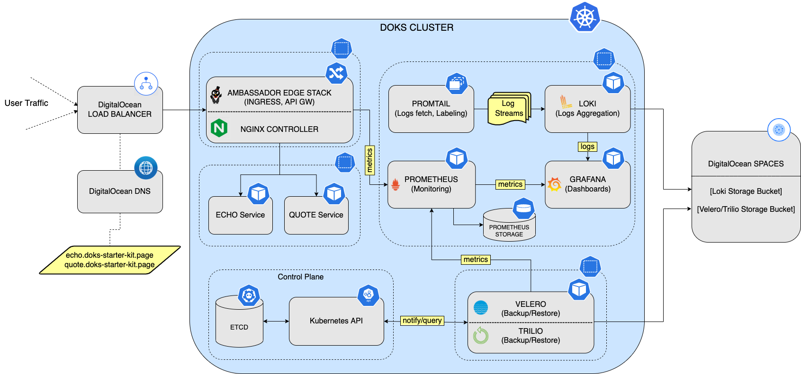

You can set up a variety of tools to make your DigitalOcean Kubernetes (DOKS) cluster operationally ready. Your operationally-ready DOKS cluster can have a set up as shown below, which includes:

- Setting up an ingress controller using Ambassador or nginx

- Installing apps such as Prometheus to monitor the cluster

- Installing apps such as Loki to aggregate logs

- Configuring backups and restoration using Velero or Trilio

This tutorial series consists of three parts:

